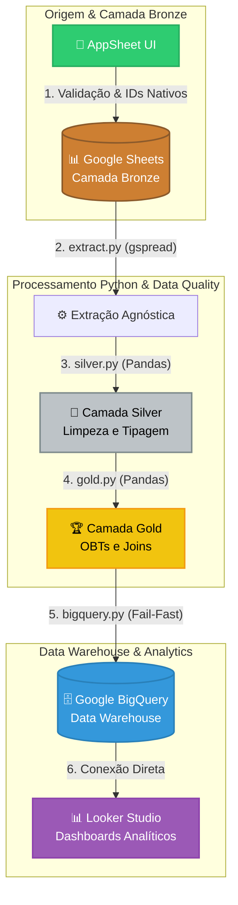

# Pipeline de Dados End-to-End: Inteligência Operacional e Analytics para ONG de Proteção Animal

Este repositório contém o ecossistema completo de engenharia de dados de um pipeline robusto, escalável e de **custo zero**, projetado para transformar dados operacionais de uma ONG de proteção animal em indicadores estratégicos.

O projeto migrou de um modelo de dados plano e vulnerável (Google Forms) para uma **arquitetura relacional moderna** utilizando **Google AppSheet** na governança de entrada, **Python (Pandas/gspread)** para orquestração e processamento nas camadas de dados, e **Google BigQuery** como Data Warehouse, servindo de base para o **Looker Studio**.


# Proposta de Valor & Resolução de Problemas de Negócio

Em organizações do terceiro setor, a tomada de decisão é frequentemente prejudicada por dados descentralizados, inconsistentes ou corrompidos por erro humano. Este projeto resolve três dores estruturais:

1.  **Falta de Integridade Referencial:** Evita o isolamento de dados clínicos (prontuários) e de saída (adoções) ao unificar o ciclo de vida do animal por meio de chaves primárias e estrangeiras geradas na origem.
    
2.  **Qualidade do Dado na Entrada (Shift-Left):** Elimina a necessidade de limpezas complexas com Regex e tratamento de strings ambíguas no pipeline de dados, movendo as regras de negócio condicionais e validações estritas para a interface do usuário.
    
3.  **Cálculo de Estoque Temporal:** Consolida algoritmos capazes de calcular dinamicamente o saldo líquido e acumulado de animais abrigados mês a mês, blindando o dashboard contra distorções causadas por períodos sem registros.


## 🏗️ Arquitetura do Sistema e Linhagem de Dados

O pipeline segue o padrão de arquitetura de medalhões, garantindo rastreabilidade e governança desde a captura até o consumo:

Snippet de código:



-   **Camada Bronze (Raw/Origem):** Tabelas estruturadas diretamente no Google Sheets, alimentadas exclusivamente via AppSheet. Os dados nascem tipados, obrigatórios onde necessário (`REQUIRED`) e com chaves relacionais exclusivas (`UNIQUEID()`).
    
-   **Camada Silver (Clean/Validated):** O script `silver.py` isola a limpeza técnica. Ele normaliza datas salvando o fuso horário (`UTC`), padroniza campos de texto ocultos para nulos reais (`pd.NA`) e realiza engenharia de atributos, explodindo listas de seleção múltipla (_EnumList_) em flags booleanas (`is_ferido`, `is_doente`, etc.).
    
-   **Camada Gold (Analytics/OBT):** O script `gold.py` realiza as transformações analíticas complexas. Ele reconstrói a relação de cardinalidade 1:N cruzando Prontuários e Saídas com as características cadastrais do animal (Espécie, Porte, Sexo) via `id_animal`, gerando tabelas no formato _One Big Table (OBT)_ otimizadas para alta performance de leitura no BI.

## Decisões de Engenharia & Diferenciais Técnicos

Ao defender este projeto em uma entrevista técnica, os seguintes pontos destacam-se como boas práticas de engenharia:

### 1. Governança Baseada em _Shift-Left Data Quality_

Ao invés de inflar a camada Silver com lógicas de deduplicação e adivinhação de strings (como algoritmos de similaridade de texto para unificar nomes de animais digitados errados), a inteligência foi movida para o front-end (AppSheet). O campo "Nome do Animal" nas tabelas transacionais foi substituído por uma referência (`Ref`) ligada ao `id_animal`. O dado chega ao Data Warehouse 100% limpo e indexado.

### 2. Validação Rígida _Fail-Fast_ no Carregamento

A camada de carga (`bigquery.py`) implementa um validador de contratos de dados (`_validar_dataframe_para_schema`). Antes de executar qualquer operação de escrita ou gastar processamento no BigQuery, o DataFrame do Pandas é confrontado contra um esquema JSON estrito definido em `schemas.py`. Se houver colunas faltantes, extras ou incompatibilidade de tipos de dados (como uma coluna `DATE` que não esteja tipada como `datetime64`), o pipeline aborta imediatamente com logs detalhados, impedindo a corrupção do Data Warehouse.

### 3. Idempotência Garantida

O processo de carga utiliza a estratégia de substituição controlada (`if_exists="replace"` associado aos schemas explícitos). Isso garante que o pipeline possa ser executado múltiplas vezes para o mesmo período sem duplicar registros ou gerar inconsistências históricas, limpando e reestruturando as tabelas nativamente.

### 4. Resiliência de Agregação Temporal na Gold

Na modelagem do saldo de animais abrigados (`gold_animais_mensal`), o pipeline gera dinamicamente uma Dimensão Calendário que cobre o intervalo do histórico. Ao efetuar o cruzamento e aplicar a soma cumulativa (`.cumsum()`), o código garante que meses onde a ONG não realizou nenhum resgate ou adoção apareçam no dashboard com valor zerado e saldo mantido, evitando quebras visuais em gráficos de linha temporal no Looker Studio.

## 🚀 Estrutura do Repositório

-   `core/config.py`: Centraliza a autenticação segura via conta de serviço do Google Cloud (GCP) e controle de retentativas de leitura de APIs.
    
-   `extract/extract.py`: Módulo focado em infraestrutura, extraindo os dados cruas de forma agnóstica ao schema utilizando a API do `gspread`.
    
-   `transform/silver.py`: Limpeza atômica, normalização de timezones e criação de variáveis booleanas.
    
-   `transform/gold.py`: Consolidação de regras de negócio, agregações analíticas e fusão dimensional (Merges).
    
-   `load/schemas.py`: O "Contrato de Dados" que espelha as regras estritas e os tipos aceitos no BigQuery.
    
-   `load/bigquery.py`: Módulo de escrita e validação preventiva (_Fail-Fast_) usando `pandas-gbq`.
    

## 🛠️ Como Executar o Pipeline

### Pré-requisitos

-   Python 3.11+
    
-   Conta de Serviço no Google Cloud Platform com permissões de administrador do BigQuery.
    
-   ID da Planilha do Google Sheets configurado.

### Configuração do Ambiente

1.  Clone o repositório:
    
    Bash
    
    ```
    git clone https://github.com/seu-usuario/ong-data-pipeline.git
    cd ong-data-pipeline
    
    ```
    
2.  Crie e ative o ambiente virtual:
    
    Bash
    
    ```
    python -m venv .venv
    source .venv/bin/activate  # Linux/Mac
    .venv\Scripts\activate     # Windows
    
    ```
    
3.  Instale as dependências:
    
    Bash
    
    ```
    pip install -r requirements.txt
    
    ```
    
4.  Configure as variáveis de ambiente (`.env`):
    
    Snippet de código
    
    ```
    GOOGLE_APPLICATION_CREDENTIALS="caminho/para/seu/token-gcp.json"
    GOOGLE_SHEETS_ID="seu_id_do_google_sheets"
    
    ```
    

### Execução

Execute o orquestrador principal do pipeline:

Bash

```
python -m ong_data_pipeline
```
